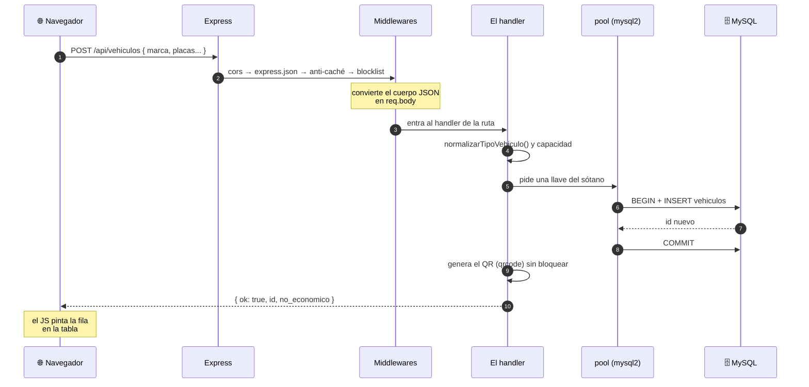

# Arquitectura de SIGEPAV — el panorama completo

> Para entender **por qué** el sistema está construido así, no solo cómo.
> Las trazas paso a paso están en [`flujos/`](flujos/); esto es la vista de arriba.
> Índice general en [`README.md`](README.md).

---

# Parte 1 · La oficina

Antes de los nombres técnicos, la imagen. SIGEPAV es **una oficina de gobierno** —
que es literalmente lo que digitaliza.

## El archivero del sótano · MySQL

Unos 20 cajones: vehículos, comisiones, vales, reportes ciudadanos, bitácora.
**Ahí vive la verdad.** Si el edificio se incendia y el archivero sobrevive, no perdiste
nada. Si se quema el archivero, da igual que el edificio siga en pie.

> Cuando `alta-edicion.html` te muestra 16 vehículos, no los tiene guardados: fue al
> sótano, abrió el cajón y copió. Cierras la pestaña y la copia desaparece. El original
> sigue abajo.

## El oficinista que atiende todo · Server.js

Una sola persona atendiendo **84 ventanillas**. Registrar un vehículo, aprobar una
comisión, generar un QR, mandar correos, hacer respaldos, recibir reportes ciudadanos:
el mismo señor, con un manual de 6,400 líneas en la cabeza.

Y es **el único con llave del sótano**. Nadie más baja al archivero.

> Que funcione no está en duda. El costo es de mantenimiento: para cambiar cómo se
> aprueban las comisiones, hay que encontrar esa página entre 6,400.

## Los formularios de papel · el frontend

La hoja que llenas **no sabe nada**: no conoce los vehículos, no sabe si tu contraseña
es correcta. Es papel con casillas. Y la **misma oficina** te entrega los formularios;
no hay papelería aparte.

> `app.use(express.static('public'))` (`Server.js:146`) — una línea que convierte a Node
> en el repartidor de los HTML. Por eso todo vive en `localhost:3000`.

## El letrero de "solo personal autorizado" · auth-guard.js

Un empleado normal lo lee, entiende que no es para él y se da la vuelta.
**Pero no hay guardia.** El letrero no detiene a quien decida caminar.

> `auth-guard.js` corre en **tu navegador**. Bloquea páginas por nombre de archivo.
> El API casi no valida. Con dos excepciones: **aprobar y rechazar finalizaciones sí
> tienen guardia real** — ahí el oficinista revisa tu credencial contra el archivero.

## El altavoz del pasillo · SSE

Cuando alguien deja una solicitud, **suena el altavoz** en la oficina del administrador.
No tuvo que estar preguntando "¿ya llegó algo?" cada cinco minutos.

> Server-Sent Events (`Server.js:4015`). Es un **altavoz, no un teléfono**: el servidor
> habla, tú no le contestas por ahí. Para eso están las ventanillas normales.

## El conserje de la madrugada · las funciones `asegurar*()`

Cada mañana, antes de abrir, baja al sótano: *"¿está el cajón de vales? ¿el de
respaldos?"*. Si falta alguno, **lo instala y se va sin decir nada**.

> **7 cajones existen solo porque el conserje los pone**: no están en el plano original
> (`sigepav_BDD.sql`). Por eso quitar esas funciones rompería el sistema — no en tu
> máquina, donde ya están puestos, sino el día que lo montes en otra.

## El cuarto de atrás · Flask

Un empleado con **un solo instrumento**: una regla para medir gasolina. No tiene llave
del sótano, no sabe de comisiones, no sabe quién eres. Tú **nunca entras**: le dices al
oficinista "necesito medir", él va, trae el número y lo anota en tu expediente.

> Y hay **una sola regla, clavada en la pared**: si Ana la mueve a 75 y Beto a 30, Ana
> lee 30 y registra el tanque de Beto. Un operador a la vez: bien. Tres celulares en una
> demo: se rompe.

## El consultor que a veces viene · Gemini

El oficinista **ya sabe** qué vehículo conviene y cuál necesita mantenimiento: lo saca de
su tabla de reglas. A veces contratan a un consultor para que **redacte bonito** ese
mismo análisis — pero **no cambia los números**.

> Con `GEMINI_API_KEY = ""`, el consultor lleva meses sin venir y **nadie lo notó**.
> "Funciona sin internet" no es un consuelo: es una característica.

## La nota pegada en el mostrador · el hack de Config.js

El teléfono del consultor no está en la agenda del oficinista: está **en una hoja pegada
en el mostrador de atención al público**. Cuando lo necesita, sale, la lee y regresa.

> `Server.js` lee la API key **parseando `public/Config.js` con una expresión regular**.
> Un archivo del frontend haciendo de configuración del backend. Si cambias el formato de
> esa línea, el backend deja de encontrarla.

---

# Parte 2 · El stack, pieza por pieza

Nueve dependencias. Un proyecto equivalente en React + Next + Prisma andaría en
novecientas. Aquí está cada una, qué hace y dónde se ve.

## 🟩 Node.js — el motor

**Qué es.** JavaScript corriendo **fuera del navegador**. Antes de Node, JS solo existía
dentro de una pestaña; Node lo saca al sistema operativo, con acceso a archivos, red y
procesos.

**Qué hace aquí.** Es el intérprete que ejecuta `Server.js`. Cuando corres `npm start`,
lo que arranca es Node leyendo ese archivo.

**Por qué importa para ti.** Escribes **el mismo lenguaje** en el navegador y en el
servidor. No cambias de idioma a media aplicación.

## 🟩 Express — el recepcionista

**Qué es.** Un framework mínimo que traduce peticiones HTTP a funciones de JavaScript.

**Qué hace aquí.** Sin Express, recibir una petición sería leer bytes de un socket a
mano. Con Express:

```js
app.get('/api/vehiculos', async (req, res) => {
    const [rows] = await pool.query('SELECT ... FROM vehiculos WHERE activo = 1');
    res.json({ ok: true, vehiculos: rows });
});
```

**Ejemplo real.** Eso de arriba es literalmente cómo se sirven tus 16 vehículos.
Express se encarga de: escuchar el puerto, reconocer que la ruta es `/api/vehiculos`,
que el método es GET, y convertir tu objeto a JSON con las cabeceras correctas.

También sirve los archivos estáticos (`Server.js:146`) — por eso el mismo servidor
entrega el HTML y responde el API.

## 🟦 MySQL — el archivero

**Qué es.** Una base de datos relacional: tablas con columnas fijas y relaciones entre
ellas.

**Qué hace aquí.** Guarda las ~20 tablas del sistema. "Relacional" significa que las
tablas se conocen entre sí:

```
usuarios ──< viajes >── vehiculos
                │
                └──< reportes_ciudadanos
```

**Ejemplo real.** Un reporte ciudadano tiene `viaje_id` y `vehiculo_id` con
`ON DELETE SET NULL`. Traducido: *"si borras el vehículo, no borres el reporte — déjalo
huérfano"*. Es lo correcto para una bitácora de transparencia: la queja sobrevive aunque
la unidad se dé de baja.

## 🟦 mysql2 — el mensajero al sótano

**Qué es.** El driver que traduce entre JavaScript y el protocolo de MySQL.

**Qué hace aquí.** Se usa la variante `mysql2/promise` (`Server.js:12`), la que permite
`await` en vez de callbacks anidados.

**El detalle que importa: el _pool_.**

```js
const pool = mysql.createPool(DB_CONFIG);   // Server.js:75
```

Un pool es un **manojo de llaves del sótano** (10 por defecto). Abrir una conexión a
MySQL es caro; en vez de abrir y cerrar en cada consulta, se mantienen 10 abiertas y se
prestan. Si llegan 11 peticiones a la vez, la última **espera turno** en vez de fallar.

**Y otro detalle real de tu configuración:** el pool fuerza `utf8mb4_unicode_ci`. Sin
eso, MySQL 8.4 usa otra colación por defecto y truena con *"Illegal mix of collations"*
al comparar textos con acentos.

## 🟨 bcryptjs — la caja fuerte de un solo sentido

**Qué es.** Un algoritmo de *hashing* diseñado a propósito para ser **lento**.

**Qué hace aquí.** Las contraseñas **nunca se guardan**. Se guarda su huella:

```
"Admin"  →  bcrypt  →  $2a$10$N9qo8uLOickgx2ZMRZoMye...
```

**No se puede revertir.** Al iniciar sesión no se descifra nada: se vuelve a hashear lo
que escribiste y se comparan las huellas (`bcrypt.compare`, `Server.js:730`).

**Por qué "lento" es la característica.** Si alguien roba tu tabla de usuarios, probar
contraseñas a la fuerza le costará años en vez de minutos. Un hash rápido tipo MD5 se
rompe en horas.

> ⚠️ Tu login además acepta contraseñas en texto plano como respaldo, si el hash no
> empieza con `$2`. Es una concesión a los datos semilla. En producción real habría que
> quitarlo.

## 🟨 nodemailer — el cartero

**Qué es.** Cliente SMTP: manda correos desde Node.

**Qué hace aquí.** Tres momentos:
1. **Recuperación de contraseña** — el enlace con token que expira a los 15 minutos.
2. **Acuse al ciudadano** — cuando manda un reporte, recibe su folio de seguimiento.
3. **Cierre del caso** — cuando el reporte se resuelve o la comisión se finaliza.

**Ejemplo real.** El correo de recuperación no lleva la contraseña (jamás se manda una
contraseña por correo): lleva un **token de un solo uso**, guardado hasheado en la BD,
con caducidad. Es el mismo patrón que usan Google o Facebook.

## 🟨 multer — la ventanilla de documentos

**Qué es.** Middleware para recibir archivos por `multipart/form-data`, que es como los
navegadores mandan archivos.

**Qué hace aquí.** Dos ventanillas distintas, con reglas distintas:

| Ventanilla | Destino | Límite | Formatos |
|---|---|---|---|
| Foto de perfil (`Server.js:161`) | `uploads/perfiles/` | 3 MB | jpg, png, webp |
| Evidencia ciudadana | `uploads/evidencias/` | 5 MB | imágenes |

**Ejemplo real.** El nombre del archivo se reescribe siempre:

```js
cb(null, `perfil_${Date.now()}_${uuidv4().slice(0,8)}${ext}`);   // Server.js:158
```

Nunca se confía en el nombre que manda el usuario. Si alguien sube un archivo llamado
`../../Server.js`, acabaría en `perfil_1786552745839_a3f9c012.js`. Eso se llama
*path traversal* y así se cierra.

## 🟨 qrcode — la imprenta

**Qué es.** Genera imágenes de códigos QR.

**Qué hace aquí.** Un PNG por vehículo, en azul institucional:

```js
const url = `${baseUrl}/ciudadano.html?token=${qrToken}`;
await QRCode.toFile(filepath, url, { width: 300, ... });   // Server.js:4235
```

**Ejemplo real.** Ese QR es **todo el flujo 3**. Un ciudadano lo escanea en la puerta de
una camioneta y aterriza en el formulario de reporte, sin cuenta y sin contraseña.

> ⚠️ La URL queda **quemada dentro de la imagen**. Si cambias el dominio de ngrok, los QR
> ya impresos apuntan a una dirección muerta. Fija la URL antes de mandarlos a imprimir.

## 🟨 uuid — el generador de folios irrepetibles

**Qué es.** Genera identificadores únicos de 128 bits, tipo
`a3f9c012-4b8e-4d3a-9f21-8c7e5b1d0e6f`.

**Qué hace aquí.** Tres usos, y **la diferencia con el `id` de la tabla es la clave**:

| Uso | Para qué |
|---|---|
| `qr_token` del vehículo | Lo que va en el QR |
| `token_seguimiento` del reporte | El folio del ciudadano |
| Nombres de archivo | Evitar colisiones |

**Por qué no usar el `id` normal.** El `id` es **adivinable**: si tu reporte es el 47, el
48 es el de alguien más. Con un UUID nadie puede pasearse por los casos ajenos cambiando
un número en la URL.

**Eso es seguridad por imposibilidad de adivinar** — apropiado para algo público, donde
no hay contraseña que valga.

## 🟥 express-rate-limit — el guardia de la fila

**Qué es.** Limita cuántas peticiones acepta una misma IP en una ventana de tiempo.

**Qué hace aquí.** Dos límites, calibrados distinto a propósito:

```js
publicApiLimiter   →  60 consultas / 15 min    (Server.js:4100)
reportLimiter      →   5 reportes / 1 hora     (Server.js:4108)
```

**Por qué la diferencia.** Consultar es barato: alguien puede recargar la página varias
veces sin mala intención. **Reportar es caro**: escribe en la base, manda correo y suena
la campana de todos los admins. Cinco por hora es suficiente para un ciudadano honesto e
insuficiente para inundar el sistema.

**Ejemplo real.** Sin esto, cualquiera con un script podría meter 10,000 reportes falsos
en un minuto y dejar el módulo ciudadano inservible el día del concurso.

## 🟥 cors — el permiso de entrada desde otro dominio

**Qué es.** Los navegadores bloquean por defecto que una página de un dominio llame al
API de otro. CORS son las cabeceras que dicen "yo sí lo permito".

**Qué hace aquí.** Con `app.use(cors())` se permite **cualquier origen**. Es lo que hace
que funcione desde `localhost`, desde la IP de la red local y desde ngrok sin tocar nada.

> ⚠️ Para un sistema institucional real habría que restringirlo a los dominios propios.
> Para una demo en red local es la decisión práctica.

## 🟪 Python + Flask — el cuarto de atrás

**Qué es.** Flask es el equivalente de Express, pero en Python: un framework web mínimo.

**Qué hace aquí.** `medidor/Gasolina.py`, 642 líneas de las que **casi todo es HTML y CSS
embebidos** — la carátula del medidor. La lógica de estado es **una línea**:

```python
nivel_actual = {"percentage": 50}     # Gasolina.py:8
```

**Ejemplo real.** No importa `mysql`, no lee el `.env`, no sabe qué es una comisión.
**Flask no es una base de datos: es un control de entrada remoto.** El número que
importa lo persiste Node en `viajes.nivel_comb_ini`.

**Y el proxy es la parte elegante** (`proxyFlask`, `Server.js:115`): el navegador nunca
habla con Flask. Sin eso, medir desde el celular pediría un **segundo túnel de ngrok** y
exponer el puerto 5000 a internet.

## ⬜ HTML + CSS + JavaScript "a secas" — el frontend

**Qué es.** Sin React, sin Vue, sin bundler, sin paso de compilación.

**Qué hace aquí.** Cada módulo es un trío: `pagina.html` + `paginaScript.js` +
`paginaStyles.css`. Más un puñado de scripts compartidos que se cargan en casi todas.

**Ejemplo real de la ventaja.** Editas `public/dashboardScript.js`, guardas, recargas.
**Ya está.** No hay `npm run build`, no hay esperar 30 segundos, no hay `node_modules`
de 400 MB. El backend además fuerza `no-store` en HTML/JS/CSS para que el navegador no
se quede con la versión vieja.

**Ejemplo real de la desventaja.** `Script.js` son 3,274 líneas cargadas en 16 de 26
páginas. Es como entregarle a **cada** persona que entra el instructivo completo de la
oficina, aunque solo venga a pagar la tenencia.

## ⬜ SSE (Server-Sent Events) — el altavoz

**Qué es.** No es un paquete: es una **técnica** del propio HTTP. El navegador abre una
conexión y la deja abierta; el servidor manda mensajes cuando tiene algo que decir.

**Qué hace aquí.** `GET /api/notificaciones/stream/:usuario_id` (`Server.js:4015`) es la
línea abierta. El servidor guarda esas respuestas por usuario y empuja eventos con
`sseEnviar()`.

**Ejemplo real.** Un operativo solicita finalizar una comisión. **Sin recargar nada**, al
administrador le aparece la notificación. Eso es SSE.

**Por qué no WebSockets.** Un WebSocket es teléfono de ida y vuelta; SSE es altavoz de un
solo sentido. Aquí el navegador nunca necesita contestar por ese canal — para eso están
las ventanillas normales. **Menos complejidad para la misma función.**

---

# Parte 3 · Por qué la app es 100% offline

Esto no era cierto hasta el 2026-08-15. **Vale la pena entender el problema, porque es
justo el argumento más fuerte del proyecto y estuvo a punto de fallar en vivo.**

## El problema

Las 26 páginas cargaban sus librerías desde **`cdnjs.cloudflare.com`**:

| Librería | En cuántas páginas | Qué se rompía sin internet |
|---|---|---|
| Font Awesome | 24 | **Ningún icono** en toda la aplicación |
| Chart.js | 1 (dashboard) | **El dashboard sin una sola gráfica** |
| jsPDF + autotable | 3 | La exportación a PDF |
| xlsx | 1 | La exportación a Excel |

Y aquí lo delicado: **la app seguía funcionando**. Podías registrar comisiones, aprobar,
generar QR — todo. Lo que se rompía era **lo que se ve**.

Imagina la demostración: *"miren, funciona sin internet"* … y la pantalla aparece sin un
solo icono y con el dashboard en blanco. El argumento se voltea en contra.

## La solución: servir todo desde el propio servidor

En vez de copiar los archivos al repositorio, se declararon como **dependencias de npm**
y se sirven desde `node_modules`:

```js
// Server.js
const VENDOR = { maxAge: '30d', immutable: true };
app.use('/vendor/fontawesome', express.static(
    path.join(__dirname, 'node_modules', '@fortawesome', 'fontawesome-free'), VENDOR));
app.use('/vendor/chartjs',  express.static(path.join(__dirname,'node_modules','chart.js','dist'), VENDOR));
app.use('/vendor/jspdf',    express.static(path.join(__dirname,'node_modules','jspdf','dist'), VENDOR));
app.use('/vendor/xlsx',     express.static(path.join(__dirname,'node_modules','xlsx','dist'), VENDOR));
```

Y en el HTML se cambió el dominio por la ruta local:

```diff
- <link href="https://cdnjs.cloudflare.com/ajax/libs/font-awesome/6.5.1/css/all.min.css" rel="stylesheet"/>
+ <link href="/vendor/fontawesome/css/all.min.css" rel="stylesheet"/>
```

**Por qué desde npm y no copiando los archivos al repo:**

| | npm + `express.static` | Copiar a `public/vendor/` |
|---|---|---|
| Peso del repositorio | Sin cambios | **+1.5 MB de binarios** |
| Versión | Fijada en `package.json` | Solo en el nombre de la carpeta |
| Actualizar | `npm update` | Volver a descargar a mano |
| Máquina nueva | `npm install` (ya era necesario) | Nada extra |

Como `npm install` ya era obligatorio para levantar el proyecto, la vía de npm no agrega
ningún paso y mantiene el repositorio limpio.

`immutable: true` con caché de 30 días le dice al navegador que esos archivos **nunca
cambian** para una versión dada: los pide una vez y ya.

## Cómo comprobarlo

Con la app corriendo, abre las herramientas de desarrollo del navegador, pestaña **Red**,
y recarga. **Todas las peticiones deben ir a `localhost`.** Si aparece un dominio externo,
algo se coló.

Verificación hecha el 2026-08-15 sobre el dashboard: **30 de 30 peticiones a
`localhost:3000`**, cero externas, con Font Awesome cargando su fuente local
(`fa-solid-900.woff2`) y Chart.js 4.4.1 dibujando las 4 gráficas.

> **Regla para el futuro:** si agregas una librería, **no pegues un `<script>` a un CDN**.
> Instálala con npm, móntala en `/vendor/...` y apunta el HTML ahí. Es la única forma de
> que la app siga siendo demostrable sin red.

---

# Parte 4 · Cómo encaja todo: el recorrido de una petición

Aterrizando las nueve piezas en un solo ejemplo — pulsar "Guardar" en un vehículo nuevo:



**Ocho piezas en un solo clic**, y ninguna sabe de las demás más de lo necesario. Eso es
lo que significa "arquitectura por capas".

---

# Parte 5 · Las decisiones y lo que costaron

| Decisión | Lo que ganaste | Lo que cuesta |
|---|---|---|
| Sin framework de frontend | Cero build, todo legible, arranca en cualquier lado | Todo a mano; `Script.js` creció a 3,274 líneas |
| Un solo `Server.js` | No hay que saltar entre 40 archivos | 6,400 líneas; encontrar algo cuesta |
| Esquema que se auto-repara | Se instala solo en una máquina nueva | El `.sql` **no** es la única fuente de verdad |
| Auth del lado del cliente | Simple, sin gestión de sesiones | **El API casi no valida** |
| IA con motor local | Funciona sin internet y sin costo | El análisis es de reglas, no aprende |
| Proxy a Flask | Un solo túnel, puerto 5000 cerrado | Dos procesos que arrancar |
| Sin tests ni linter | Avanzas rápido | **Cada cambio se verifica a mano** |

Las tres debilidades reales —el monolito del backend, el monolito del frontend y la falta
de pruebas— **no se tocan antes del INNOVATEC**. Son trabajo de después: alto riesgo y
cero beneficio visible para el concurso.

---

# Parte 6 · Cómo defenderlo

Si un juez pregunta *"¿por qué no usaste un framework moderno?"*:

> **Porque puedo explicar cada línea.**
>
> Nueve dependencias, y sé el nombre de todas. El sistema arranca con doble clic en una
> máquina sin internet. Y la parte de análisis inteligente sigue funcionando aunque se
> caiga la red, porque es un motor de reglas propio y no una llamada a un servicio ajeno.

Los tres argumentos son **verificables en vivo**, que es lo que los hace fuertes:

1. **Apaga el WiFi** y el sistema sigue operando, IA incluida.
2. **Apaga Flask** y todo sigue menos el medidor, que avisa con un mensaje claro.
3. **Señala cualquier línea** y hay respuesta.

En un concurso, eso vale más que un stack de moda que no puedas sostener bajo preguntas.
