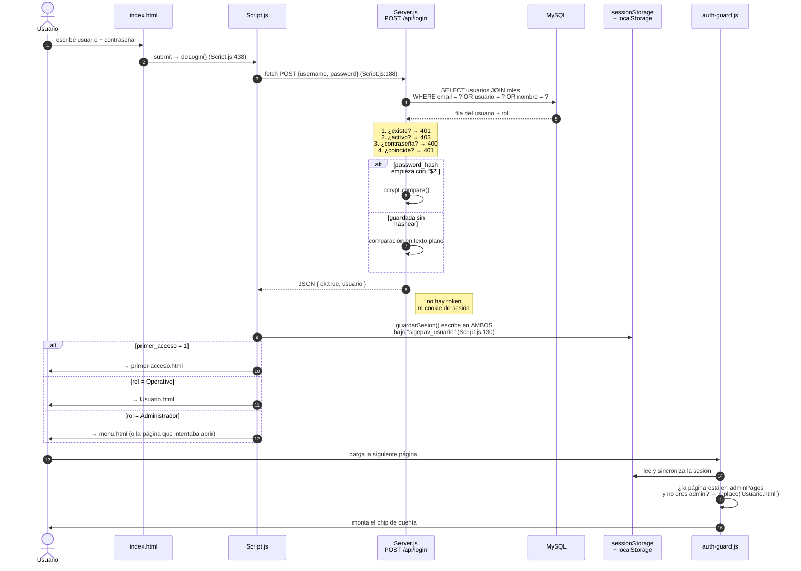
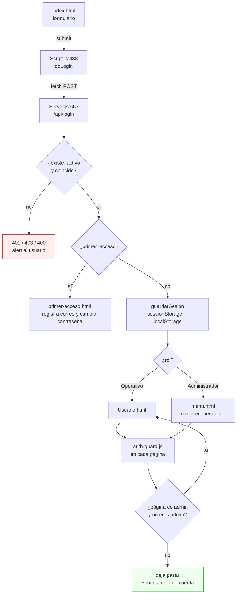

# Flujo 1 — Login y roles

> Traza de ingeniería inversa. Modelo: **entrada → proceso → estado interno → salida → fallo**.
> Las referencias son `archivo:línea` del código real.
> Índice general en [`../README.md`](../README.md).

## Recorrido en una vista



### El mismo recorrido, en bloques



## Paso a paso

### Paso 0 — Qué carga `index.html`

`public/index.html:56-57` carga, en este orden:
`indexScript.js` → `Config.js` → `Script.js` → `ui-interaction-fix.js`

**Trampa #1:** `indexScript.js` **no tiene nada del login**. Son 13 líneas que definen
`window.sigepavLoading`, el overlay de "Procesando...". El nombre miente: todas las demás
páginas siguen el patrón `paginaScript.js` = lógica de esa página, y esta es la excepción.

**Trampa #2:** `index.html` es de las pocas páginas que **no cargan `auth-guard.js`**.
Tiene sentido — es la página pública de entrada, no hay sesión que vigilar todavía.

`Config.js` define `API_BASE = window.location.origin`. Por eso el sistema funciona igual
en `localhost:3000`, en la red local o detrás de ngrok, sin recompilar ni configurar nada.

### Paso 1 — El submit · `Script.js:437-449`

```js
loginForm.addEventListener('submit', async (e) => {
    e.preventDefault();                                  // no recarga la página
    const username = document.getElementById('login-user')?.value || '';
    const password = document.getElementById('login-password')?.value || '';
    if (window.sigepavLoading) window.sigepavLoading.show('Iniciando sesión...');
    try { await doLogin(username, password); }
    finally { if (window.sigepavLoading) window.sigepavLoading.hide(); }
});
```

El `finally` garantiza que el overlay se quite aunque el login truene. Detalle chico, pero
es la diferencia entre "falló y me avisó" y "se quedó congelado".

### Paso 2 — La petición · `Script.js:186` y `Script.js:122`

```js
const apiFetch = (path, options = {}) => fetch(`${API_BASE}${path}`, options);
```

`doLogin` manda `POST /api/login` con `{ username, password }` en JSON. Nada más:
ni token, ni cabecera de autenticación, ni cookie. Es la primera y única vez que la
contraseña viaja.

### Paso 3 — El backend · `Server.js:667`

**La consulta real:**

```sql
SELECT u.id, u.nombre, u.apellidos, u.email, u.password_hash, u.activo,
       u.rol_id, u.departamento, u.cargo, u.foto_perfil, u.primer_acceso,
       r.nombre AS rol
  FROM usuarios u
  JOIN roles r ON r.id = u.rol_id
 WHERE u.email = ?
    OR SUBSTRING_INDEX(u.email, '@', 1) = ?
    OR u.nombre = ?
 LIMIT 1
```

Ese `OR` triple es la razón de que puedas entrar de **tres formas distintas** con el mismo
usuario: `aldair@itszn.edu.mx`, `aldair`, o tu nombre tal cual está en la tabla.
El `JOIN roles` es lo que convierte `rol_id = 1` en el texto `'Administrador'`.

**Las cuatro puertas, en orden:**

| Revisión | Si falla | Código |
|---|---|---|
| ¿Existe el usuario? | `401 Usuario no encontrado` | `Server.js:688` |
| ¿Está activo? | `403 Cuenta desactivada` | `Server.js:693` |
| ¿Mandaste contraseña? | `400 La contraseña es requerida` | `Server.js:699` |
| ¿Coincide? | `401 Contraseña incorrecta` | `Server.js:712` |

**La comparación de contraseña · `Server.js:705-710`:**

```js
let okPass = false;
if (u.password_hash && u.password_hash.startsWith('$2')) {
    okPass = await bcrypt.compare(password, u.password_hash);   // hash bcrypt
} else {
    okPass = (u.password_hash === password);                    // ← texto plano
}
```

`$2` es el prefijo de los hashes bcrypt (`$2a$`, `$2b$`). Si el campo **no** empieza así,
compara en texto plano. Eso existe porque el SQL semilla guarda contraseñas literales
(`Admin`, `Usuario`) en vez de hashes. Funciona, pero significa que **una contraseña
guardada sin hashear se acepta tal cual**.

**Rama de primer acceso · `Server.js:718`:** si `primer_acceso = 1`, responde
`{ ok: true, primer_acceso: true, usuario }` y el frontend desvía a `primer-acceso.html`,
donde el usuario registra su correo de recuperación y cambia la contraseña que le puso
el administrador.

### Paso 4 — De regreso en el navegador · `Script.js:196-239`

**Dónde queda el estado · `Script.js:130`:**

```js
function guardarSesion(usuario) {
    const raw = JSON.stringify(usuario || null);
    try { sessionStorage.setItem(SESSION_KEY, raw); } catch (e) {}
    try { localStorage.setItem(SESSION_KEY, raw); } catch (e) {}
}
```

Se guarda el **objeto usuario completo** bajo la llave `sigepav_usuario`, **en los dos
almacenamientos**. El motivo está comentado en `Script.js:127`: como cada módulo es un HTML
distinto, la sesión tiene que sobrevivir al cambio de página. Los `try/catch` vacíos son
por si el navegador tiene el almacenamiento bloqueado (modo privado, políticas).

**A dónde te manda:**

```js
const rolNorm = String(data.usuario.rol || '').trim().toLowerCase();
const esAdmin = (rolNorm === 'administrador' || rolNorm === 'admin');
if (!esAdmin) { window.location.href = 'Usuario.html'; return true; }
```

El comentario de `Script.js:211-214` documenta un bug ya corregido: antes comparaba contra
`'usuario'`, que nunca coincidía con lo que devuelve la tabla `roles`, y **el operativo se
quedaba en el panel de administrador**. Por eso hoy la comparación es tolerante a mayúsculas.

Si eres admin, antes de mandarte a `menu.html` revisa
`sigepav_redirect_after_login` (`Script.js:227-238`): si habías intentado abrir una página
concreta y te sacó al login, te devuelve ahí. Ese valor lo dejó `auth-guard.js` al expulsarte.

### Paso 5 — La página siguiente · `auth-guard.js`

Cada página protegida carga `auth-guard.js`, que hace tres cosas al arrancar:

1. **Lee y sincroniza** (`auth-guard.js:28`): busca la sesión en `sessionStorage`, si no
   está la busca en `localStorage`, y **reescribe ambos** para que queden iguales.
2. **Aplica la guardia de rol** (`auth-guard.js:305`): tiene un objeto `adminPages` con
   nombres de archivo. Si no eres admin y la página está en la lista →
   `window.location.replace('Usuario.html')`.
3. **Monta el chip de cuenta**: inyecta el avatar, el correo, "Mi perfil" y el botón de
   cerrar sesión en cualquier contenedor `.info-usuario` de la página.

Si **no** hay sesión y la página no es pública, guarda a dónde querías ir y te manda al login.

## Lo que NO pasa — y es lo más importante del flujo

**No se emite ningún token, ni cookie de sesión, ni nada equivalente.**

El backend responde con el usuario y **se olvida de ti por completo**. No hay estado de
sesión en el servidor. En consecuencia:

- Ningún endpoint sabe quién hace la petición. Verificado: cero coincidencias de
  `requireAuth`, `isAdmin`, `verificarToken` o middleware equivalente en todo `Server.js`.
- Cuando un endpoint necesita saber quién eres, **el propio navegador se lo dice** mandando
  `usuario_id` en el body o en la URL. El servidor le cree.
- Por lo tanto **`auth-guard.js` no es seguridad, es navegación**: decide qué pantallas te
  muestra, no a qué datos puedes llegar. Cualquiera que sepa la URL del endpoint puede
  llamarlo directo sin pasar por el login.

Para una app en red local durante un concurso es una decisión defendible; documentarla es
mejor que fingir que no existe. Si alguien del jurado pregunta "¿cómo protegen los datos?",
esta es la respuesta honesta, y viene con la solución: metes un middleware que valide un
token firmado y lo aplicas a las rutas `/api/*` salvo las públicas.

## Puntos de falla

| Síntoma | Causa probable | Dónde verificar |
|---|---|---|
| "Usuario no encontrado" con el correo correcto | El `JOIN roles` no encuentra fila: `rol_id` apunta a un rol inexistente | `Server.js:679` |
| Entra pero rebota al login una y otra vez | Almacenamiento bloqueado: `guardarSesion` falla en silencio por los `catch` vacíos | `Script.js:132` |
| El operativo ve el panel de administrador | `rol` en la BD no es exactamente `Administrador`/`Operativo` | `Script.js:215` |
| Contraseña correcta y aun así la rechaza | El `password_hash` empieza con `$2` pero no es un hash válido → `bcrypt.compare` da false | `Server.js:706` |
| Se queda en "Iniciando sesión..." para siempre | No debería: el `finally` siempre quita el overlay. Si pasa, el servidor no respondió | `Script.js:446` |
| Te deja entrar a una página de admin siendo operativo | Esa página **no está** en el mapa `adminPages` | `auth-guard.js:305` |

> **Nota sobre la última:** `adminPages` cubre 14 páginas, pero el menú de administrador
> expone al menos 6 más (`costos.html`, `salud-flota.html`, `vencimientos.html`,
> `configuracion.html`, `Ia.html`, `manual.html`). El mapa se quedó atrás cuando se
> agregaron módulos. Dado que la guardia es cosmética, no cambia el nivel real de
> protección — pero sí es inconsistente con su propio criterio.
