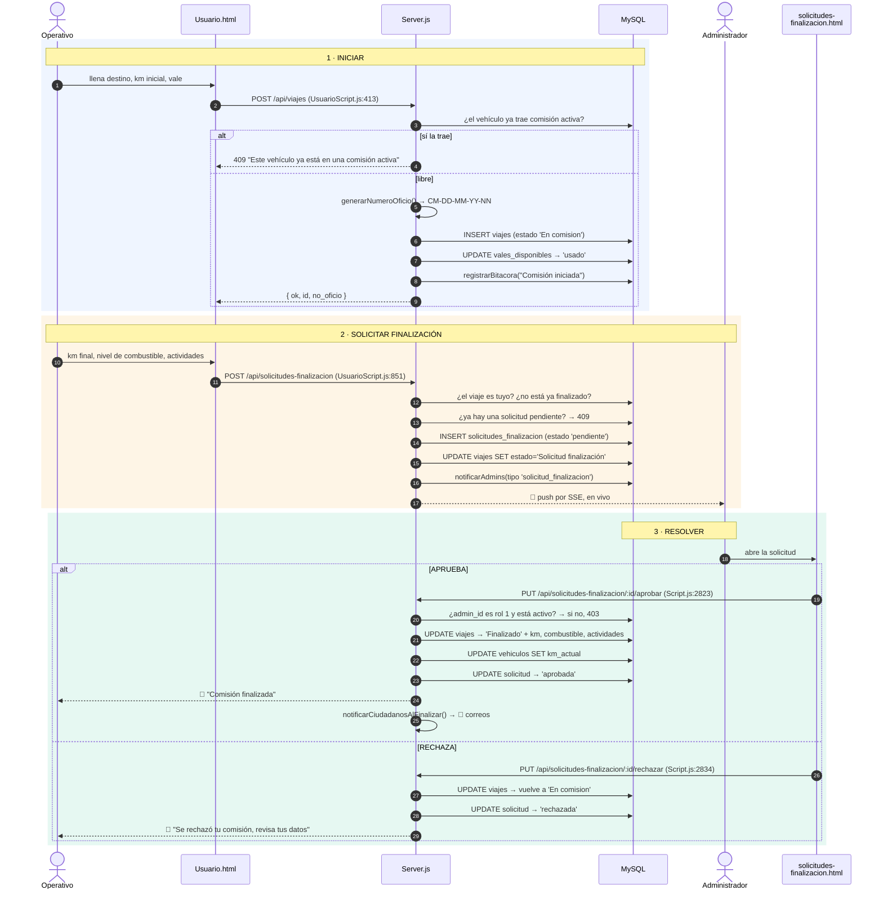
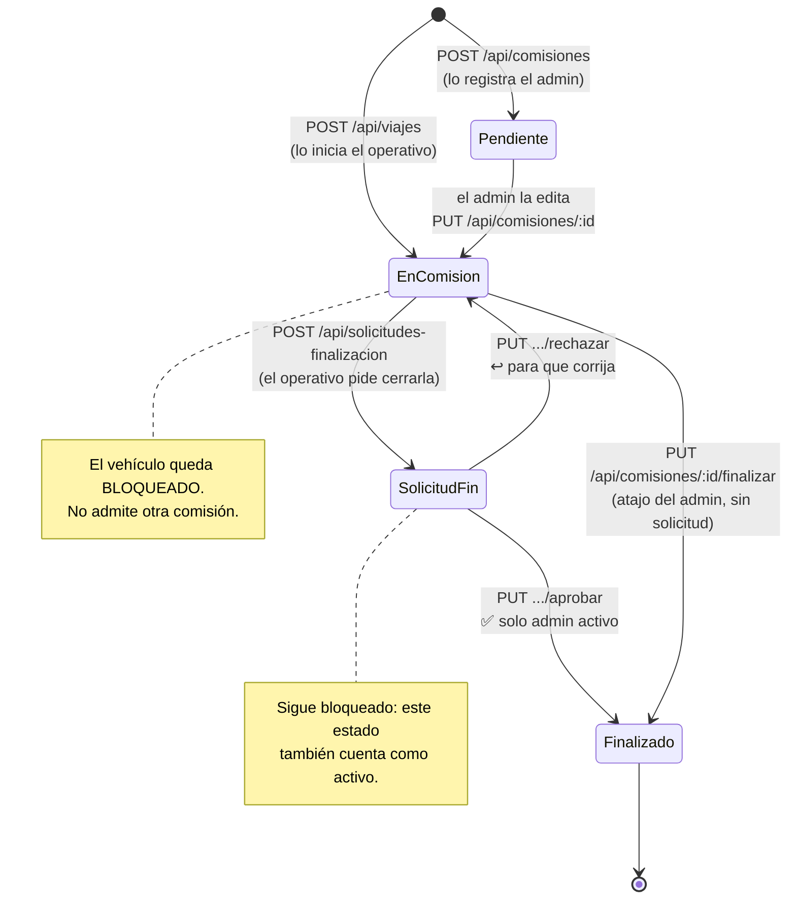

# Flujo 2 — Comisión completa: registrar → solicitar fin → aprobar

> Traza de ingeniería inversa. Modelo: **entrada → proceso → estado interno → salida → fallo**.
> Las referencias son `archivo:línea` del código real.
> Índice general en [`../README.md`](../README.md).

Este es el corazón de SIGEPAV. Toca **3 tablas**, los **2 roles**, notificaciones en
tiempo real, bitácora y hasta correos a ciudadanos. Si entiendes este flujo, entiendes
la mayor parte del sistema.

---

## Lo primero: hay UNA tabla y DOS puertas de entrada

Todo lo que aquí llamamos "comisión" vive en la tabla **`viajes`**. No hay tabla
`comisiones`: el nombre es solo el del módulo. Y a esa tabla se entra por dos endpoints
distintos según quién registre:

| Quién | Endpoint | Estado inicial | Dónde |
|---|---|---|---|
| **Administrador** | `POST /api/comisiones` | `'Pendiente'` | `Server.js:2919` |
| **Operativo** | `POST /api/viajes` | `'En comision'` | `Server.js:3224` |

Son dos caminos con reglas parecidas pero **no idénticas**, y esa asimetría explica
varias rarezas más adelante.

---

## Recorrido completo



---

## La máquina de estados

Todo el flujo se reduce a cómo se mueve `viajes.estado`. Este es el diagrama que
conviene tener en la cabeza:



**Los estados que bloquean el vehículo** están en `ESTADOS_COMISION_ACTIVA`
(`Server.js:528`), y los consulta `obtenerComisionActivaVehiculo()` (`Server.js:605`).

---

## Paso a paso

### 1 · Iniciar la comisión

**Entrada.** El operativo llena el formulario en `Usuario.html`: vehículo, destino,
km inicial, nivel de combustible y, opcionalmente, un vale del combo.

**Proceso** (`POST /api/viajes`, `Server.js:3224`):

1. **Valida lo obligatorio** — `usuario_id`, `vehiculo_id`, `lugar_destino`, `km_inicial`. Si falta algo → **400**.
2. **El candado del vehículo.** `obtenerComisionActivaVehiculo()` busca si esa unidad
   ya trae una comisión en curso. Si sí → **409** con el número y destino de la otra.
   Es la regla de negocio más importante del módulo: **un vehículo, una comisión a la vez**.
3. **Deriva el responsable.** Si el front no lo mandó, lo arma con el nombre y apellidos
   del usuario logueado, o su correo como respaldo.
4. **Consume el vale.** Si se eligió uno, verifica que exista y siga `'disponible'`
   (si no → 404 o 409), y copia sus litros, precio y folio al viaje.
5. **Genera el oficio.** Siempre en el servidor, ignorando lo que mande el front.
6. **INSERT** en `viajes` con estado `'En comision'` y un `qr_token` (`UUID()`).
7. **Marca el vale** como `'usado'` y lo enlaza al viaje.
8. **Bitácora.**

**Salida.** `{ ok: true, id, no_oficio }`.

### 2 · Solicitar la finalización

Aquí está la decisión de diseño que define el módulo: **el operativo no puede cerrar su
propia comisión**. Solo puede *pedir* que se cierre.

**Proceso** (`POST /api/solicitudes-finalizacion`, `Server.js:3639`):

1. **¿La comisión es tuya?** Compara `viajes.usuario_id` contra el `usuario_id` recibido → **403** si no.
2. **¿Ya está finalizada?** → **409**.
3. **¿Ya hay solicitud pendiente?** → **409**, y devuelve el `solicitud_id` existente
   para que el front no cree duplicados.
4. **INSERT** en `solicitudes_finalizacion` con estado `'pendiente'`.
5. **Mueve el viaje** a `'Solicitud finalización'` — *no* a Finalizado.
6. **Notifica a todos los administradores** con `notificarAdmins()` (`Server.js:3998`),
   que a su vez llama a `crearNotificacion()` por cada admin activo y empuja el evento
   por **SSE** con `sseEnviar()` (`Server.js:3953`). La campana del admin suena sin recargar.
7. **Bitácora.**

### 3 · Resolver

#### Aprobar (`Server.js:3763`)

**Este endpoint sí valida el rol.** Consulta al `admin_id` en la BD y exige
`rol_id === 1` y `activo`; si no → **403**. Es de los **pocos endpoints del sistema que
verifican permisos del lado del servidor** (ver la nota de seguridad en `CLAUDE.md`).

Después, en orden:

1. **Finaliza el viaje** copiando lo que traía la solicitud. Usa `COALESCE(?, campo)`,
   así que **si la solicitud trae un campo en null, se conserva el valor que ya tenía
   el viaje** en vez de borrarlo.
2. **Actualiza el kilometraje del vehículo** — solo si la solicitud trae `km_final`.
   Este es el punto donde `vehiculos.km_actual` avanza; de ahí comen el mantenimiento
   programado y los cálculos de costo por km.
3. **Marca la solicitud** como `'aprobada'`, con `admin_id`, comentario y `resuelta_at`.
4. **Notifica al operativo** (tipo `comision_aprobada`, con `referencia_id = viaje_id`
   para que el enlace lleve al registro exacto).
5. **Bitácora.**
6. **`notificarCiudadanosAlFinalizar()`** (`Server.js:5042`) — busca reportes ciudadanos
   ligados a ese viaje que aún no se hayan notificado y **les manda correo**. Es el
   puente entre este flujo y el módulo ciudadano (flujo 3).

#### Rechazar (`Server.js:3843`)

Mismo control de rol. La diferencia clave: **el viaje regresa a `'En comision'`**, no
se queda atorado. El operativo puede corregir sus datos y volver a solicitar.

---

## Fallos y limitaciones conocidas

### 🔴 El número de oficio tiene una carrera

`generarNumeroOficio()` (`Server.js:654`) lee el consecutivo más alto del día y le suma 1:

```js
const [rows] = await conn.query(
    `SELECT no_oficio FROM viajes WHERE no_oficio LIKE ? ORDER BY id DESC LIMIT 1`,
    [prefijo + '%']
);
let siguiente = 1;
if (rows.length > 0 && rows[0].no_oficio) { ... siguiente = ultimo + 1; }
return prefijo + String(siguiente).padStart(2, '0');
```

**Leer y escribir no son atómicos.** Si dos personas registran una comisión en el mismo
segundo, ambas leen el mismo `NN` y generan **el mismo número de oficio**. No hay índice
único en `no_oficio` que lo impida.

En la práctica, con dos o tres usuarios, es casi imposible que pase. En una demo en vivo
con varias personas registrando a la vez, es posible.

### 🟠 `POST /api/comisiones` inventa un usuario si no se lo mandan

`Server.js:2996`:

```js
usuario_id || 1, parseInt(vehiculo_id, 10),
```

Si el front no manda `usuario_id`, **la comisión se le atribuye al usuario 1** en
silencio. En la base semilla, ese es el administrador Aldair. No falla, no avisa: solo
queda mal asignada. El camino del operativo (`POST /api/viajes`) sí lo exige.

### 🟠 El estado se guarda con y sin acento

`ESTADOS_COMISION_ACTIVA` (`Server.js:528`) tiene que listar las cuatro variantes:

```js
const ESTADOS_COMISION_ACTIVA = [
    'En comisión',  'En comision',
    'Solicitud finalización', 'Solicitud finalizacion'
];
```

Eso no es paranoia: es la prueba de que en la base **conviven las dos escrituras**.
El estado es una cadena libre en vez de un `ENUM`, así que distintas partes del código
lo escribieron distinto. La lista defensiva evita el bug, pero el problema de raíz sigue.

### 🟡 El operativo puede pedir finalizar una comisión "Pendiente"

La validación solo rechaza si el estado es exactamente `'Finalizado'`. Una comisión que
el admin dejó en `'Pendiente'` acepta solicitud de finalización sin haber "iniciado".

### 🟡 Nada es transaccional

Ni el alta ni la aprobación usan `beginTransaction()`. En la aprobación son **cuatro
UPDATE seguidos** (viaje, vehículo, solicitud, notificación). Si el proceso se cae a la
mitad, el viaje puede quedar `'Finalizado'` con el kilometraje del vehículo sin
actualizar. El alta de vehículos sí usa transacción (`beginTransaction()` en
`Server.js:2483`), así que el patrón existe en el proyecto — aquí simplemente no se aplicó.

---

## Detalles que cuestan descubrir

- **No existe tabla `comisiones`.** Todo es `viajes`. El módulo se llama distinto que la tabla.
- **`no_oficio` lo genera siempre el servidor** e ignora deliberadamente lo que mande el
  navegador. Formato `CM-DD-MM-YY-NN`, consecutivo por día.
- **Cada viaje nace con un `qr_token`** (`UUID()`), aunque el QR ciudadano cuelgue del
  vehículo. Es lo que permite rastrear una comisión concreta desde fuera.
- **El vale es de un solo uso.** Pasa a `'usado'` y guarda su `viaje_id`; el siguiente
  intento de usarlo recibe 409.
- **`vehiculos.km_actual` solo avanza al aprobar** una finalización. Ningún otro punto
  del flujo lo mueve.
- **La notificación al operativo lleva `referencia_id`**, así que el enlace abre la ficha
  exacta y no el listado. Eso se arregló junto con el deep-link (ver historial de git).

---

## Para verlo con tus propios ojos

1. Entra como **Diego** (`diego@itszn.edu.mx` / `Usuario`) e inicia una comisión.
2. Intenta iniciar **otra con el mismo vehículo** → debe salir el 409 del candado.
3. Solicita finalizarla.
4. Entra como **Aldair** (`aldair@itszn.edu.mx` / `Admin`): la campana debe traer la
   notificación **sin recargar** la página (eso es el SSE).
5. Rechaza la solicitud → la comisión vuelve a estar en curso para Diego.
6. Vuelve a solicitar y ahora **apruébala** → revisa que el `km_actual` del vehículo
   haya avanzado en el módulo de Altas y edición.
