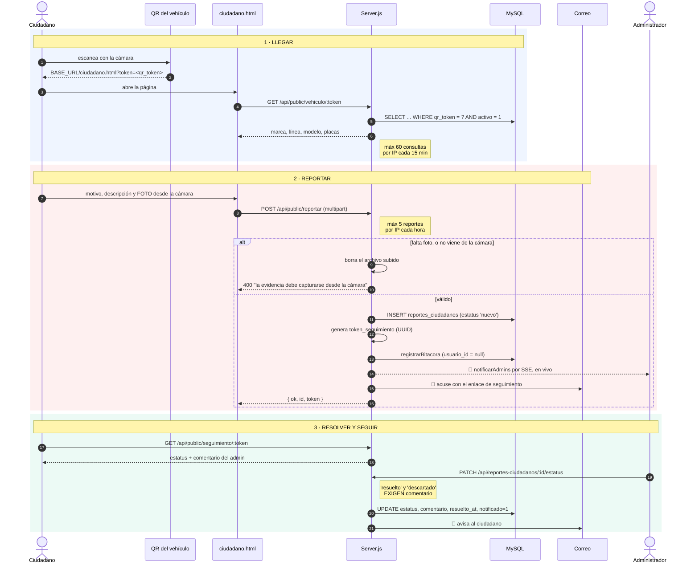
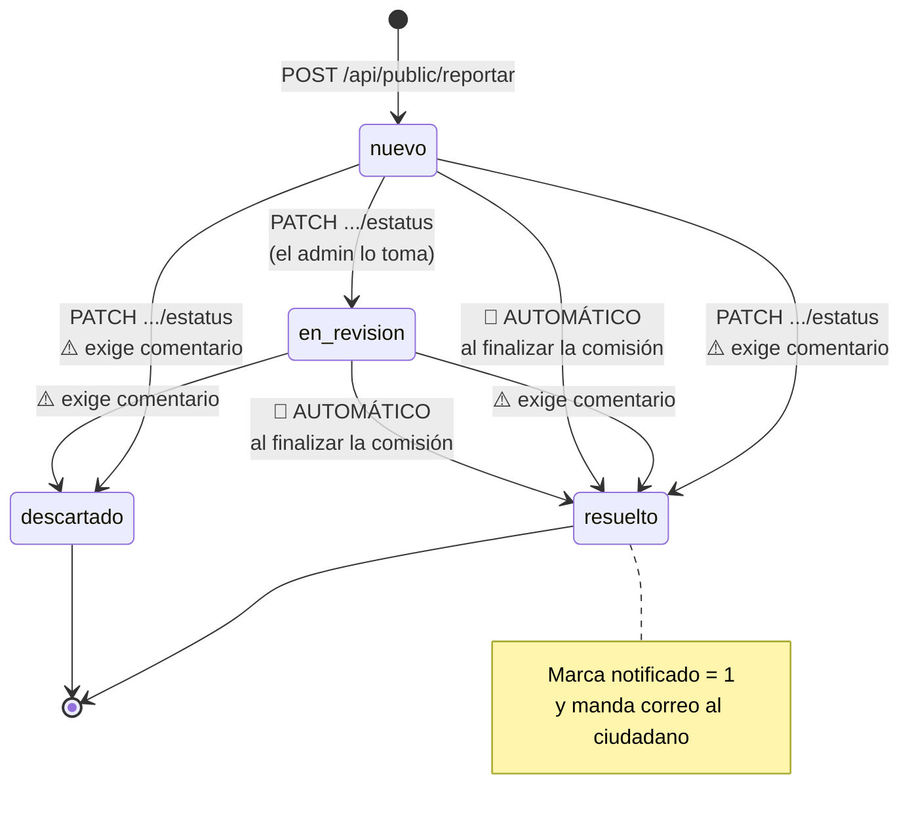

# Flujo 3 — Reporte ciudadano por QR

> Traza de ingeniería inversa. Modelo: **entrada → proceso → estado interno → salida → fallo**.
> Las referencias son `archivo:línea` del código real.
> Índice general en [`../README.md`](../README.md).

Este es **el único camino que entra a SIGEPAV sin sesión**. Alguien de la calle escanea
el QR pegado en un vehículo institucional, reporta lo que vio, y puede darle seguimiento
después — todo sin cuenta, sin contraseña y desde el teléfono.

Para el concurso es la carta más fuerte: es transparencia real, no una pantalla más.

---

## Recorrido completo



---

## Los dos tokens (no confundirlos)

Aquí hay **dos UUID distintos** que hacen cosas distintas. Es lo que más confunde al
leer el código:

| Token | Vive en | Para qué sirve |
|---|---|---|
| **`vehiculos.qr_token`** | Un vehículo | Es lo que está impreso en el QR. Identifica **la unidad**. Permanente. |
| **`reportes_ciudadanos.token_seguimiento`** | Un reporte | Se genera al enviar el reporte. Es el "número de folio" con el que **ese ciudadano** consulta su caso. Único por reporte. |

El primero te deja **entrar**; el segundo te deja **volver**.

---

## La máquina de estados del reporte



Fíjate en las dos flechas marcadas **🤖 AUTOMÁTICO**: no las dispara el admin. Vienen
del flujo 2 y son el hallazgo más importante de esta traza (ver abajo).

---

## Paso a paso

### 1 · Llegar por el QR

**Qué codifica el QR** (`generarQRVehiculo()`, `Server.js:4224`):

```js
const url = `${baseUrl}/ciudadano.html?token=${qrToken}`;
```

Un PNG de 300 px en azul institucional, guardado en `uploads/qr/qr_<id>.png`.

**Al abrirse**, `ciudadano.html` consulta `GET /api/public/vehiculo/:token`
(`Server.js:4293`), que busca `WHERE qr_token = ? AND activo = 1` y devuelve **solo
datos públicos** de la unidad: marca, línea, modelo, tipo, color y placas. Nada de
usuarios, nada de costos.

Protegido por `publicApiLimiter` (`Server.js:4100`): **60 consultas por IP cada 15 minutos**.

### 2 · Enviar el reporte

`POST /api/public/reportar` (`Server.js:4515`). Es el endpoint más defendido del sistema,
y con razón: es la única puerta abierta a internet.

**Las cinco validaciones**, en orden:

1. **Correo con formato válido** → 400.
2. **Motivo** presente y ≤ 100 caracteres → 400.
3. **Descripción de mínimo 15 caracteres** → 400. Evita reportes vacíos tipo "mal".
4. **Foto obligatoria** → 400. Sin evidencia no hay reporte.
5. **La foto debe venir de la cámara** (`evidencia_origen === 'camara'`). Si no,
   **borra el archivo recién subido** con `fs.unlinkSync()` y responde 400.

Además `reportLimiter` (`Server.js:4108`) permite **5 reportes por IP cada hora**, y
multer corta las imágenes de más de 5 MB (413).

**Después de validar:**

- Recorta todo a la longitud de su columna (`slice(0, 150)`, `slice(0, 2000)`, etc.).
- Si vienen `viaje_id` o `vehiculo_id`, **verifica que existan** en la BD → 400 si no.
- Genera el `token_seguimiento` con `uuidv4()`.
- **INSERT** con estatus `'nuevo'`.
- **Bitácora con `usuario_id = null`** — no hay sesión, y la tabla lo permite.
- **`notificarAdmins()`** → cada admin recibe la campana **por SSE, sin recargar**.
- **Correo de acuse** al ciudadano con su enlace de seguimiento.

**Salida:** `{ ok: true, id, token }`.

### 3 · Dar seguimiento (el ciudadano)

`/seguimiento-publico/:token` (`Server.js:4121`) sirve el HTML, y
`GET /api/public/seguimiento/:token` (`Server.js:4636`) devuelve el estado del caso:
`estatus`, `comentario_admin` y `resuelto_at`.

Ese mismo endpoint también resuelve tokens de `comision_interesados` — la otra forma de
seguimiento, para quien solo quiso enterarse de una comisión sin reportar nada.

### 4 · Resolver (el administrador)

`PATCH /api/reportes-ciudadanos/:id/estatus` (`Server.js:4883`):

- Valida contra `['nuevo','en_revision','resuelto','descartado']` → 400.
- **`resuelto` y `descartado` exigen comentario** → 400 si viene vacío. Nadie cierra un
  reporte ciudadano sin explicar por qué.
- El `UPDATE` usa `CASE WHEN` para tocar `comentario_admin`, `resuelto_at` y `notificado`
  **solo** cuando el estatus final lo amerita.
- Manda correo al ciudadano y deja rastro en bitácora.

---

## El puente con el flujo 2 (y el hallazgo importante)

Cuando un administrador aprueba la finalización de una comisión (flujo 2, paso 3), se
llama `notificarCiudadanosAlFinalizar()` (`Server.js:5042`). Esa función busca todos los
reportes ligados a ese viaje **que aún no se hayan notificado**:

```sql
WHERE viaje_id = ? AND notificado = 0
```

Y por cada uno, si el correo se envía bien (`Server.js:5191`):

```js
'UPDATE reportes_ciudadanos SET notificado = 1, estatus = "resuelto" WHERE id = ?'
```

### 🔴 Finalizar una comisión resuelve los reportes solo

Ese `estatus = "resuelto"` no lo pidió nadie. **Un reporte ciudadano puede pasar a
"resuelto" sin que un administrador lo haya leído jamás**, únicamente porque la comisión
del vehículo se cerró.

Y como el `UPDATE` no toca `comentario_admin`, el reporte queda **resuelto sin
explicación**, mientras que la ruta manual del admin *sí* exige comentario obligatorio.
Son dos criterios opuestos para el mismo estado final.

No lo toqué porque puede ser intencional —cerrar el ciclo automáticamente es defendible—,
pero conviene que sea una decisión consciente y no un efecto secundario.

### 🟠 Si el correo falla, el ciudadano nunca se entera

El `notificado = 1` solo se escribe **si el correo salió** (`if (correoEnviado)`). Si el
SMTP falla, el reporte se queda en `notificado = 0`… y **no hay reintento**:
`notificarCiudadanosAlFinalizar()` se llama únicamente al aprobar la finalización, y esa
comisión ya no se va a aprobar dos veces.

Resultado: correo caído = ese ciudadano nunca recibe respuesta, y en la interfaz del
admin el reporte se ve como si todo hubiera salido bien.

---

## Otras limitaciones

### 🟠 Los QR dependen de `BASE_URL`

El QR lleva la URL **quemada dentro de la imagen**. Si cambias el dominio de ngrok, todos
los QR impresos apuntan a una dirección muerta. `backfillQRVehiculos()` (`Server.js:253`)
los regenera al arrancar cuando detecta que `BASE_URL` cambió — pero **los que ya
imprimiste y pegaste en los vehículos siguen siendo los viejos**.

Para el concurso: fija la URL antes de imprimir los QR.

### 🟡 El QR identifica, no autoriza

`POST /api/public/reportar` recibe el `vehiculo_id` **en el cuerpo del formulario**, y
solo comprueba que exista. **No verifica que corresponda al `qr_token` por el que entró
el ciudadano.** Escanear el QR es una comodidad —te llena el formulario—, no un permiso:
con una petición armada a mano se puede reportar cualquier unidad.

### 🟡 Lo de "solo cámara" es una declaración del cliente

La regla `evidencia_origen === 'camara'` es sólida en intención, pero el valor lo escribe
el propio navegador (`ciudadanoScript.js:474`, un `formData.append('evidencia_origen', 'camara')`
fijo). El servidor no tiene forma de distinguir una foto tomada en vivo de una subida
desde la galería con ese campo falsificado.

Frena a un usuario normal en el teléfono, que es el 99% del caso. No frena a alguien
que sepa usar las herramientas de desarrollo.

---

## Detalles que cuestan descubrir

- **`ciudadano.html` y `seguimiento-publico.html` tienen ruta propia** en Express
  (`Server.js:4117` y `4121`), aparte del `express.static`. La segunda existe para que
  el enlace del correo se vea limpio: `/seguimiento-publico/<token>`.
- **`auth-guard.js` deja pasar `seguimiento-publico.html` sin sesión** — está en su lista
  de páginas públicas junto con `index.html` (ver flujo 1).
- **Los `viaje_id` y `vehiculo_id` del reporte son `ON DELETE SET NULL`**: si borras el
  vehículo, el reporte sobrevive huérfano en vez de desaparecer. Es lo correcto para una
  bitácora de transparencia.
- **`uploads/evidencias/` está en `.gitignore`** — las fotos de los ciudadanos nunca se
  suben al repositorio.
- **El módulo entero se auto-crea al arrancar** con `asegurarTablasCiudadano()`
  (`Server.js:4130`): las tablas `reportes_ciudadanos` y `comision_interesados` **no
  están en `sigepav_BDD.sql`**.

---

## Para verlo con tus propios ojos

1. Con la app corriendo, abre `uploads/qr/qr_8.png` — es el QR del vehículo 8.
2. Escanéalo con el teléfono (si `BASE_URL` apunta a ngrok) o abre a mano
   `http://localhost:3000/ciudadano.html?token=<el qr_token del vehículo>`.
3. Llena un reporte. **Vas a necesitar dar permiso de cámara**: sin foto no pasa.
4. Guarda el `token` que devuelve y ábrelo en `/seguimiento-publico/<token>`.
5. Entra como **Aldair** y mira que la campana ya traía el reporte, sin recargar.
6. Intenta marcarlo "resuelto" **sin comentario** → debe rechazarte.
