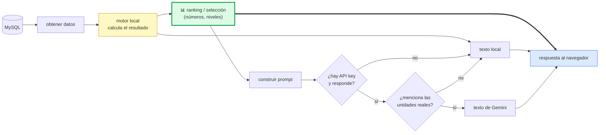
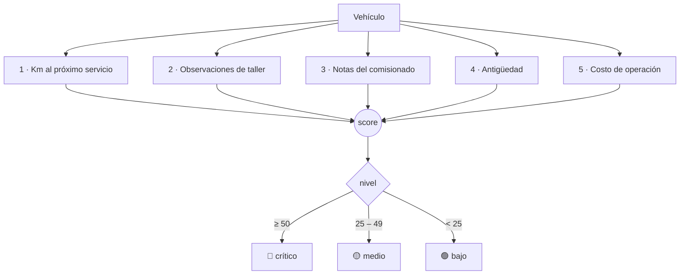

# Flujo 4 — Salud de la flota y el motor de IA

> Traza de ingeniería inversa. Modelo: **entrada → proceso → estado interno → salida → fallo**.
> Las referencias son `archivo:línea` del código real.
> Índice general en [`../README.md`](../README.md).

Este es el módulo que más impresiona en una demo y el que peor se entiende leyendo el
código por encima. La confusión típica es pensar que "la IA analiza la flota".

**No lo hace.** Y entenderlo bien es lo que te va a permitir defenderlo frente a un jurado.

---

## La idea central: la IA no calcula, solo redacta

Los tres endpoints de IA siguen **el mismo patrón**, y este es el que hay que grabarse:



Fíjate en la flecha gruesa: **el ranking siempre viene del motor local**. Gemini nunca
toca los números. Lo único que puede cambiar es el **párrafo ejecutivo** que acompaña
a la tabla.

Se ve clarísimo en el endpoint (`Server.js:2380`):

```js
const ranking = calcularRankingParque(datos);        // ← siempre local
const local   = generarAnalisisParqueLocal(ranking); // ← texto local
const gemini  = await consultarGeminiParque(ranking);// ← puede ser null
res.json({
    fuente:   gemini ? 'gemini' : 'local',
    analisis: gemini?.texto || local,                // ← solo la prosa cambia
    ranking                                          // ← SIEMPRE el local
});
```

**Consecuencia práctica:** hoy tu `GEMINI_API_KEY` está vacía, así que todo corre por el
motor local — y aun así el módulo funciona completo. Si en la demo se te cae el internet,
el ranking sigue saliendo igual. Eso es una fortaleza, no una carencia.

---

## Los cuatro endpoints

| Endpoint | Qué hace | Motor local |
|---|---|---|
| `GET /api/ia/parque` (`Server.js:1666`) | Lista el parque para los selectores | — |
| `POST /api/ia/recomendacion` (`Server.js:2406`) | Qué vehículo asignar a N personas | `generarRecomendacionLocal()` |
| `POST /api/ia/mantenimiento` (`Server.js:2145`) | Diagnóstico de una unidad | `generarAnalisisMantenimientoLocal()` |
| `GET /api/ia/parque/predictivo` (`Server.js:2380`) | **Ranking de urgencia de toda la flota** | `calcularRankingParque()` |

El último es el que alimenta la pantalla **Salud de la flota**, y es el interesante.

---

## El algoritmo de urgencia (esto es "la IA")

`calcularRankingParque()` (`Server.js:2224`) le pone un **score** a cada vehículo sumando
cinco factores. Sin machine learning, sin modelos: son reglas explícitas que puedes
explicar y defender una por una.



### Los cinco factores y sus puntos

| # | Condición | Puntos |
|---|---|---|
| **1** | Servicio **vencido** por km | **+40** |
| | Faltan ≤ 1,000 km | +25 |
| | Faltan ≤ 2,000 km | +10 |
| **2** | Cada observación de taller **crítica** pendiente | **+20 c/u** |
| | Cada observación pendiente no crítica | +8 c/u |
| **3** | Cada viaje con una nota de falla del operador | **+15 c/u** |
| **4** | Unidad de 25+ años | +12 |
| | Unidad de 15+ años | +8 |
| | Unidad de 10+ años | +4 |
| **5** | Costo acumulado ≥ 66% del más caro de la flota | +10 |

### El factor 3 es el más ingenioso

Los operadores no escriben "falla en el sistema de transmisión". Escriben *"no metió la
cuarta subiendo"*. El sistema traduce ese español coloquial a categorías con un catálogo
de palabras clave (`IA_SENALES_FALLA`, `Server.js:2174`):

| Categoría | Palabras que la disparan |
|---|---|
| Transmisión | `no metio`, `no entra`, `cuarta`, `la marcha`, `cambios` |
| Embrague | `clutch`, `embrague`, `patina` |
| Frenos | `freno`, `chillido`, `balata`, `rechina` |
| Sobrecalentamiento | `temperatura`, `se calienta`, `no enfria`, `humo`, `hierve` |
| Fuga | `fuga`, `gotea`, `mancha de aceite` |
| Ruido/Vibración | `ruido`, `vibra`, `traqueteo`, `cascabeleo` |
| Falla general | `jalo feo`, `se apago`, `no arranca`, `tirón`, `jalones` |

`iaDetectarSenalesNota()` normaliza el texto (quita acentos, baja a minúsculas) antes de
comparar, así que *"no metió"* y *"NO METIO"* caen igual.

**Esto es lo que hay que enseñar en la demo:** el sistema lee lo que escribió el chofer
en lenguaje natural y lo convierte en una señal de mantenimiento. Es explicable al 100%,
que es más de lo que puedes decir de un modelo de caja negra.

---

## El anclaje anti-alucinación

Detalle de diseño que vale la pena presumir. En `consultarGeminiParque()`
(`Server.js:2334`), después de recibir la respuesta del modelo:

```js
const requeridos = top.slice(0, 3).map(r => String(r.no_economico).trim());
...
const mencionaTop = requeridos.every(eco => norm.includes(iaNormalizarTexto(eco)));
if (!mencionaTop) {
    console.warn(`Gemini parque ${modelo} no referenció las unidades reales del ranking; se usa el análisis local.`);
    continue;
}
```

**Si Gemini no menciona los números económicos reales del top-3, su respuesta se
descarta** y se prueba el siguiente modelo; si ninguno pasa, se usa el texto local.

Es una defensa concreta contra el problema clásico de los modelos de lenguaje: inventar
unidades que no existen. Súmale `temperature: 0.25` y `maxOutputTokens: 500`, y el
recorrido por varios modelos en orden (`modelosGeminiPreferidos()`, `Server.js:1813`),
que además antepone los modelos del *free tier* aunque `Config.js` liste otros.

---

## La recomendación de vehículo

`generarRecomendacionLocal()` (`Server.js:1722`) resuelve: *"voy a comisionar a N
personas, ¿qué unidad me toca?"*

**Estrategia 1 — una sola unidad.** De las que caben N personas, elige la que **menos
sobra**: minimiza `capacidad - personas`. La idea es no mandar una Urvan de 15 plazas
por dos personas.

**Estrategia 2 — dos unidades.** Si ninguna sola alcanza, prueba **todos los pares
posibles** y se queda con el de menor `extra * 100 + total`, es decir, el que menos
desperdicia.

**El modificador de carga.** `iaMotivoRequiereCarga(motivo)` detecta si el motivo de la
comisión implica llevar equipo o material; si sí, **las pickups suben de prioridad**.

Si ni con dos unidades alcanza, lo dice claramente en vez de inventar algo.

---

## Fallos y limitaciones

### 🔴 Las notas de falla nunca prescriben, y suman sin techo

La consulta de notas (`Server.js:2205`) no tiene **filtro de fecha ni `LIMIT`**:

```sql
SELECT vehiculo_id, no_vale, lugar_destino, observaciones, fecha_inicio
  FROM viajes
 WHERE observaciones IS NOT NULL AND observaciones <> ''
 ORDER BY COALESCE(fecha_fin, fecha_inicio, created_at) DESC
```

Y el bucle suma **+15 por cada viaje con nota, sin tope** (`Server.js:2259`).

Dos consecuencias:

1. **Una falla arreglada hace dos años sigue penalizando.** Si el chofer escribió "rechina
   el freno" y las balatas se cambiaron al día siguiente, esos +15 siguen ahí para siempre.
2. **El score crece sin límite.** Un vehículo muy usado con 10 notas históricas acumula
   **+150 puntos solo por el factor 3**, y el umbral de "crítico" es 50. Queda clavado en
   rojo aunque hoy esté impecable.

Con datos de demo no se nota. Con dos años de operación real, el ranking se degrada solo:
los vehículos más viejos y más usados quedan permanentemente en rojo y el módulo pierde
capacidad de discriminar. **El arreglo natural sería una ventana de tiempo** (por ejemplo,
solo notas de los últimos 6 meses) **y un tope** al factor.

### 🟠 El catálogo de palabras es frágil por diseño

Solo detecta lo que está en la lista. *"Se jalonea"* no aparece (sí `jalones`), *"no
frena"* cae en Frenos por `freno`, pero *"los balatas ya no sirven"* solo pega por
`balata`. Cualquier expresión nueva **pasa invisible** y no suma nada.

No es un bug: es el costo de un método basado en reglas. La ventaja es que puedes ampliar
el catálogo en 30 segundos y explicar exactamente por qué saltó una alerta. La desventaja
es que hay que mantenerlo.

### 🟠 El factor de costo es siempre relativo

`costo >= costoMax * 0.66` compara contra **el vehículo más caro de la flota**, no contra
un presupuesto. Si una unidad dispara sus costos, sube `costoMax` y **las demás dejan de
activar el factor** aunque su gasto no haya bajado.

### 🟡 La búsqueda de pares es O(n²)

Dos bucles anidados sobre los vehículos disponibles (`Server.js:1758`). Con 16 unidades
son 120 comparaciones: instantáneo. Con 500 serían 124,750 en cada petición. Vale la pena
saberlo, no arreglarlo hoy.

---

## Detalles que cuestan descubrir

- **La API key se lee parseando `public/Config.js` con regex**, no de una variable de
  entorno (ver `CLAUDE.md`). El archivo del frontend es fuente de configuración del backend.
- **`modelosGeminiPreferidos()` antepone los modelos gratuitos** a lo que diga
  `Config.js`, así que aunque alguien liste modelos de pago, se intentan primero los Flash.
- **La UI ya distingue el origen**: el badge dice "Motor local" o el nombre del modelo
  según `fuente`. No hay engaño en la interfaz.
- **`generarAnalisisParqueLocal()` solo describe el top-3** con score > 0. Si toda la
  flota está sana, devuelve un mensaje de "todo en orden" en lugar de un análisis vacío.
- **El costo acumulado se calcula igual que en el módulo de Costos**: combustible
  (`vales_combustible`) + mantenimiento (`mantenimiento_observaciones`), en una sola query
  con dos `LEFT JOIN` de subconsultas agregadas (`Server.js:2212`).

---

## Para verlo con tus propios ojos

1. Abre **Salud de la flota** en el menú. El badge debe decir **"Motor local"** (tu key
   está vacía).
2. Toma un vehículo del top y contrasta sus "razones" con sus datos reales en Altas y
   edición: los km al servicio, las observaciones pendientes.
3. Registra una comisión escribiendo en observaciones algo como
   *"no metió la cuarta y se calentó en la subida"*.
4. Recarga Salud de la flota: esa unidad debe **subir 15 puntos** y mostrar las categorías
   **Transmisión** y **Sobrecalentamiento**.
5. Prueba `POST /api/ia/recomendacion` con 2 personas y luego con 20: la primera te da una
   unidad chica, la segunda debe proponerte **dos vehículos** o decirte que no alcanza.
