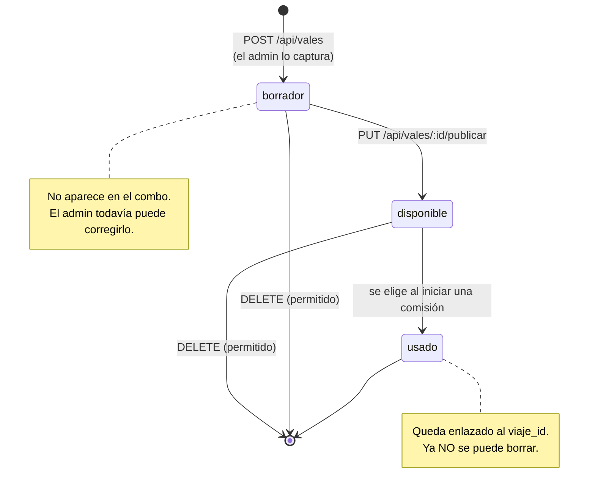
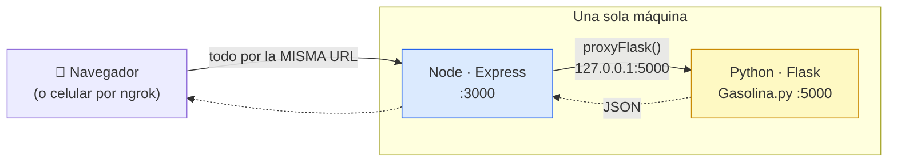
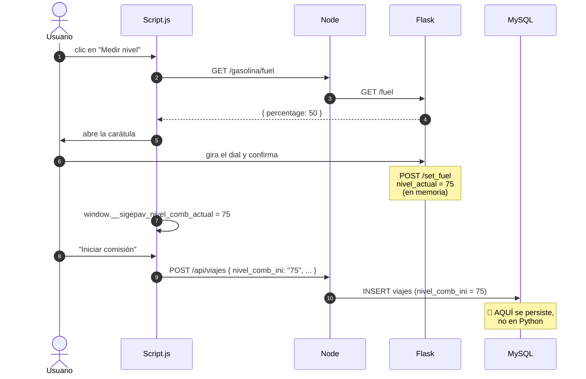

# Flujo 5 — Vale de combustible y el medidor en Python

> Traza de ingeniería inversa. Modelo: **entrada → proceso → estado interno → salida → fallo**.
> Las referencias son `archivo:línea` del código real.
> Índice general en [`../README.md`](../README.md).

Este flujo tiene dos mitades que se ven parecidas y **no lo son**:

- El **vale** es un documento con ciclo de vida, guardado en MySQL.
- El **medidor** es un servicio aparte, en otro lenguaje, que **no guarda nada**.

Es el único punto del sistema donde SIGEPAV sale de Node y entra a Python.

---

## Parte A — El vale de combustible

### Ciclo de vida



**Por qué existe `borrador`.** Un vale capturado a medias no debe poder asignarse a una
comisión. Solo `GET /api/vales/disponibles` (`Server.js:2727`) alimenta el combo, y filtra
`WHERE estado = 'disponible'`. Publicarlo es un paso deliberado y **de un solo sentido**:

```sql
UPDATE vales_disponibles SET estado = 'disponible'
 WHERE id = ? AND estado = 'borrador'
```

Si el vale ya estaba publicado o usado, `affectedRows` es 0 y responde **409**. La
condición está en el `WHERE`, no en un `if` previo — así que dos clics simultáneos no
pueden publicarlo dos veces.

### Cómo se consume

Esto ocurre dentro del **flujo 2**. Cuando se inicia una comisión con `vale_id`
(`Server.js:3224` o `2919`), el backend:

1. Busca el vale y **verifica que siga `'disponible'`** → 409 si ya lo usaron.
2. **Copia sus datos al viaje**: `no_vale`, `folio` → `ticket_no`, `litros`,
   `precio_litro`, `cantidad` → `costo_total`.
3. Marca el vale como `'usado'`, guarda su `viaje_id` y el `used_at`.

**Los datos del vale ganan sobre lo que mande el navegador.** En `POST /api/comisiones`
(`Server.js:2962`) se ve explícito:

```js
const valeNo   = valeRow ? valeRow.no_vale : (vale || 'S/V');
const litrosN  = valeRow ? Number(valeRow.litros) : (parseFloat(litros) || 0);
```

Si hay vale, el formulario no puede contradecirlo. Si no lo hay, el viaje queda con
`'S/V'` (sin vale) y los valores capturados a mano.

> La relación es `ON DELETE SET NULL`: si se borra el viaje, el vale sobrevive con
> `viaje_id` en null. La evidencia de gasto no desaparece.

---

## Parte B — El medidor en Python

### Cómo se conectan Node y Flask



**El navegador nunca habla con Flask.** Node hace de intermediario con `proxyFlask()`
(`Server.js:115`), que reenvía tres rutas:

| El navegador pide | Node reenvía a Flask |
|---|---|
| `/gasolina` | `/` (la interfaz del medidor) |
| `/gasolina/fuel` o `/fuel` | `/fuel` (leer el nivel) |
| `/gasolina/set_fuel` o `/set_fuel` | `/set_fuel` (fijar el nivel) |

**Por qué está hecho así.** Sin el proxy, para usar el medidor desde un celular
necesitarías **un segundo túnel de ngrok** apuntando al puerto 5000, y exponer Flask a
internet. Con el proxy, todo entra por la misma URL pública y el puerto 5000 solo escucha
en `127.0.0.1`. Es la decisión de arquitectura más limpia del proyecto.

**Si Flask está apagado**, `proxyFlask()` responde **503** con un mensaje claro en vez de
tronar. El medidor es opcional: el resto de SIGEPAV funciona igual.

### Qué hace realmente Gasolina.py

642 líneas, de las cuales la enorme mayoría es **HTML y CSS embebidos** en un
`render_template_string`: la carátula del medidor. La lógica de estado son tres líneas.

```python
nivel_actual = {"percentage": 50}     # Gasolina.py:8
```

**Eso es todo el almacenamiento.** Una variable global en memoria.

| Ruta | Qué hace |
|---|---|
| `GET /` | Devuelve la carátula del medidor |
| `GET /fuel` | Lee `nivel_actual` |
| `POST /set_fuel` | Valida que sea número entre 1 y 100 y lo escribe |

Todas las respuestas pasan por `sin_cache()` para que el navegador no se quede con un
valor viejo.

### El recorrido completo del nivel



**La conclusión que hay que sacar:** Flask **no es una base de datos, es un control de
entrada remoto**. Un dial bonito que funciona desde el celular. El valor que importa lo
guarda Node en `viajes.nivel_comb_ini` y `viajes.nivel_comb_fin` (`Script.js:1117` y
`2677`), y de ahí lo lee todo lo demás.

La variable global de Python es solo el **papelito** donde se anota el número entre que el
usuario gira el dial y el navegador lo lee de vuelta.

---

## Fallos y limitaciones

### 🔴 El nivel es uno solo para todo el mundo

`nivel_actual` es **una variable global compartida**. No hay sesión, ni usuario, ni
vehículo asociado.

Si dos personas usan el medidor al mismo tiempo:

1. Ana mide su unidad y fija **75**.
2. Beto mide la suya y fija **30**.
3. Ana confirma su comisión → el navegador lee `/fuel` → obtiene **30**.

**Ana registra el nivel del vehículo de Beto.** No hay error, no hay aviso: el dato
simplemente queda mal.

Es aceptable con un solo operador a la vez, que es el uso real. En una demo con varias
personas probando desde sus celulares, va a pasar.

El arreglo natural sería que `set_fuel` recibiera un identificador (de sesión o de
vehículo) y `nivel_actual` fuera un diccionario en vez de un solo número.

### 🟠 Reiniciar Flask borra el nivel

Al arrancar vuelve a `50`. No es grave —el valor real ya está en MySQL— pero el dial
aparece a la mitad aunque el último usuario lo hubiera dejado en 10.

### 🟠 El medidor no sabe de qué vehículo habla

No recibe `vehiculo_id` ni valida nada contra la comisión en curso. Es un dial genérico;
la asociación la hace el navegador al mandar el `nivel_comb_ini`.

### 🟡 El vale se consume aunque la comisión falle después

El `UPDATE` a `'usado'` ocurre **inmediatamente después** del `INSERT` del viaje, sin
transacción (ver flujo 2). Si algo falla entre ambos, el vale puede quedar marcado como
usado apuntando a un viaje inconsistente.

### 🟡 Node y Flask no comparten configuración

`FUEL_INTERNAL_URL` (`Server.js:113`) apunta por defecto a `http://127.0.0.1:5000`. Si
alguien cambia el puerto en `Gasolina.py`, hay que cambiarlo también en el `.env`. Nada
lo verifica al arrancar: simplemente empiezan los 503.

---

## Detalles que cuestan descubrir

- **`Gasolina.py` no toca MySQL.** No importa `mysql`, no lee el `.env`. Es completamente
  independiente; sus únicas dependencias son `Flask` y `flask-cors`.
- **Las rutas cortas `/fuel` y `/set_fuel` existen sin el prefijo `/gasolina`** por
  compatibilidad con la versión anterior, cuando el navegador sí hablaba directo con Flask.
- **`abrirMedidor()` está duplicado** en `Script.js` (admin) y `UsuarioScript.js`
  (operativo), como las otras 8 funciones que comparten. Cambiar el medidor implica tocar
  los dos archivos.
- **`window.__sigepav_nivel_comb_actual`** es la variable global del navegador que carga
  el valor entre que se cierra el medidor y se envía el formulario.
- **El vale usado ya no se puede borrar**: `DELETE /api/vales/:id` (`Server.js:2829`) lo
  impide, para no perder la evidencia del gasto.

---

## Para verlo con tus propios ojos

1. Arranca todo con `INICIAR-SIGEPAV.bat` (levanta Node **y** Flask).
2. Entra como admin → **Registro de vales** → captura uno. Queda en **borrador**.
3. Ve a registrar una comisión: **ese vale no aparece en el combo todavía**.
4. Regresa, **publícalo**, y vuelve: ahora sí aparece.
5. En el formulario de comisión, dale a **"Medir nivel"**: se abre la carátula de Python,
   servida a través de Node.
6. Fija un nivel, confirma, e inicia la comisión.
7. Revisa en la base: `SELECT no_vale, nivel_comb_ini FROM viajes ORDER BY id DESC LIMIT 1`.
   Ahí está el nivel — **en MySQL, no en Python**.
8. **Apaga Flask** y recarga: el resto de la app sigue funcionando; solo el medidor
   responde 503.
